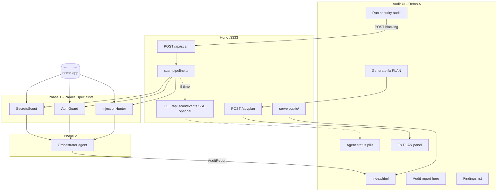

# VibeGuard: Multi-Agent Security Scanner (1-Hour Hackathon)

**Implementation phases:**

- [60-minute phased build](./security-multi-agent-demo-phases.md) — full Demo A with live agents
- [20-minute phased build](./security-multi-agent-demo-phases-20min.md) — sample-driven UI + PLAN; live scan as follow-up

## Goal

Ship **`npm run dev`** — the **Demo A** surface: a local **Audit UI** on port **3333** where you click **Run security audit**, watch three specialists run in parallel, review an **audit report** from the **Orchestrator**, then **generate a fix PLAN** and **Copy for Cursor** on `demo-app`.

```bash
npm run dev          # http://localhost:3333 — only demo path in scope
npm run scan         # dev/CI helper; same runScan() as API; writes public/audit-report.json
```

**In scope:** [Demo A — Audit to fix](#demo-a-audit-to-fix-in-scope) only.

**Out of scope for the hour:** Demo B (before/after safe repo), Demo C (overlap UI tags), Demo D (CI slide), fourth specialist, cloud runtime, Orchestrator-enhanced PLAN.

**Stack:** TypeScript + `@cursor/sdk` + **Hono** + **vanilla HTML/CSS/JS** (no React build for the scanner UI). **Runtime:** always **local** with `CURSOR_API_KEY` from `.env`. Model: `composer-2.5`.

**Branding:** UI title **VibeGuard**; npm package / repo name stays **`attack-vector-detector`** (extend existing `src/`, do not nest a `vibeguard/` subproject).

**Naming:**
- **Orchestrator** — Phase 2 synthesis *agent* (dedupe, grade, narrative). Not the TypeScript **scan pipeline** (`scan-pipeline.ts`).
- **Audit report** — structured JSON from the Orchestrator (`AuditReport`).
- **Fix PLAN** — deterministic markdown from `plan.ts` for coding agents.

---

## Implementation decisions (locked)

Decisions from planning interview — treat as fixed unless the build is blocked.

| Topic | Decision |
|-------|----------|
| **Primary demo** | **Demo A only** — scan → audit → copy PLAN → paste in Cursor on `demo-app` |
| **Repo layout** | Extend **repo root** (`src/`, `public/`, `demo-app/`); reuse `src/agents/run-agent.ts` |
| **Demo app** | **Minimal Next.js 14+ App Router** — only files needed for 6 planted vulns; README one-liner for presenter |
| **Planted vulns** | **6** (table below); **omit** `eval()` (#7) to save time |
| **Safe repo / Demo B** | **Not built** — post-hackathon |
| **Runtime** | **Always local:** `Agent.prompt(..., { local: { cwd: targetRepo, settingSources: [] } })` + `CURSOR_API_KEY` — no cloud runtime |
| **Parallelism** | `Promise.all` for three specialists; **one scan at a time** (409 if busy) |
| **Progress UI** | **Default: blocking `POST /api/scan`** + spinner on pills; **add SSE only if ahead of schedule** |
| **Scan response** | **200 + `AuditReport` body** on success; SSE mirrors same events when implemented |
| **Partial failure** | If **≥2** specialists return valid JSON → run Orchestrator on their findings; else **502** with `{ error, partial }`. Startup failures → **503** (`CursorAgentError`) |
| **JSON from agents** | Prompt requires raw JSON only; server **strips fences** → `JSON.parse`; **one retry** prompt (“fix JSON only”) per agent on parse failure |
| **Finding IDs** | Specialists may omit `id`; server assigns **`{agent}-{file}-{line}-{n}`** on merge; Orchestrator may rewrite titles but preserves ids when deduping |
| **Grade** | **Orchestrator** assigns `A`–`F` using a short rubric in prompt (e.g. any critical → at most `D`); server validates string |
| **Dedup** | Orchestrator merges same **file + line + category**; no “also reported by” UI in v1 |
| **Fix PLAN** | **`plan.ts` only** — critical + high, **max 5 tasks**, sort **severity → file path**; time-box disclaimer always on top (**Q19**) |
| **PLAN UI** | No per-finding checkboxes v1; no filter tabs v1; sort findings critical-first in UI |
| **`POST /api/plan`** | Server-side `buildFixPlan` in v1 (skip duplicating logic in `app.js`) |
| **Port** | **3333** hardcoded (fastest; no env config) |
| **Offline fallback** | Commit **`public/audit-report.json`** sample so UI + PLAN work **without running a scan** (e.g. rehearsal slide); **live scan always requires API key** |
| **CLI** | `npm run scan` calls **`runScan()`** same as API; prints grade one-liner + path to open UI; writes `public/audit-report.json` |
| **Rehearsal** | Demo A script **under 3 minutes**; if scans are slow, presenter uses committed sample for PLAN half and runs live scan once |

---

## Demo A: "Audit to fix" (in scope)

Canonical presenter script — rehearse this twice before demo day.

1. Open **`http://localhost:3333`** — empty or last audit from `audit-report.json`; three gray specialist pills.
2. Optional: open **`demo-app/README.md`** — *"Shipped in one Cursor session."*
3. Click **Run security audit** — pills go running → done; Orchestrator pill appears; grade **F** (or similar), exploit chain and findings populate.
4. Scroll findings — call out **one critical** (e.g. client admin token or committed `.env`).
5. Click **Generate fix PLAN** → preview → **Copy for Cursor** → switch to Cursor with **`demo-app`** as cwd and paste: *"Execute this remediation PLAN within the time box."*
6. Optional beat: refresh browser — last audit still visible from `public/audit-report.json`.

**Success = this flow only.** Do not block the hour on alternate demo paths.

---

## Architecture



**Data flow:**
1. `localhost:3333` loads UI; hydrate from `public/audit-report.json` if present.
2. **Run security audit** → `POST /api/scan` (default target `./demo-app`) → `runScan()` with `CURSOR_API_KEY`.
3. **(Optional)** SSE `GET /api/scan/events` for pill updates; otherwise blocking request + loading state.
4. **200** response body = `AuditReport` → render hero + findings; write `public/audit-report.json`.
5. **Generate fix PLAN** → `POST /api/plan` → preview + **Copy for Cursor**.

**SDK:** `Agent.prompt` for 4 agents via existing `runAgent()` wrapper. Log `runId` per agent.

**Guardrails:**
- `local.cwd` = resolved `demo-app` path always
- `CursorAgentError` → 503; `result.status === "error"` → agent error event / partial 502
- `settingSources: []` (no `.cursor/rules` leakage into specialists)

---

## Repo layout

```
attack-vector-detector/          # package name unchanged; UI branded VibeGuard
├── package.json                 # scripts: dev, scan, typecheck
├── tsconfig.json
├── .env.example                 # CURSOR_API_KEY=
├── src/
│   ├── server.ts                # Hono, static, API
│   ├── scan.ts                  # CLI → runScan()
│   ├── scan-pipeline.ts         # runScan(target, onProgress?) → AuditReport
│   ├── plan.ts                  # buildFixPlan(auditReport) → markdown
│   ├── config.ts                # requireApiKey()
│   ├── agents/
│   │   ├── run-agent.ts         # existing Agent.prompt wrapper
│   │   └── types.ts
│   ├── parse-agent-json.ts      # fence strip, parse, single retry helper
│   ├── prompts/
│   │   ├── secrets.ts
│   │   ├── auth.ts
│   │   ├── injection.ts
│   │   └── orchestrator.ts
│   └── types.ts                 # Finding, AgentReport, AuditReport
├── public/
│   ├── index.html
│   ├── styles.css
│   ├── app.js
│   └── audit-report.json        # committed sample + runtime write (gitignore live overwrite optional)
└── demo-app/                    # minimal Next.js, 6 vulns
    └── ...
```

---

## Specialist design (80/20)

**Three agents** cover ~**80% of common web app issues** with minimal topology (no fourth agent in the hour).

| Agent | ~OWASP / theme | In scope | Out of scope (other agents or post-v1) |
|-------|----------------|----------|----------------------------------------|
| **secrets-scout** | Secrets & misconfig | Committed `.env`, hardcoded API keys/tokens, client bundle leaks, `NEXT_PUBLIC_*` secrets | Auth logic, SQLi, XSS |
| **auth-guard** | Broken access control | Missing route auth, IDOR (`userId` params), open admin APIs, privilege hints | Injection sinks, secret strings in code |
| **injection-hunter** | Injection & unsafe rendering | SQL/string concat queries, reflected/stored XSS sinks, `dangerouslySetInnerHTML`, `eval` if present | Missing login middleware, `.env` files |

**Prompt discipline:** each specialist returns **only** `AgentReport` JSON scanning **`demo-app`**; focus on **planted patterns** first, then obvious variants in the same files (reduces false positives during a 60-minute demo).

```typescript
interface AgentReport {
  agent: "secrets-scout" | "auth-guard" | "injection-hunter";
  findings: Omit<Finding, "id">[];  // id optional; server fills
}
```

### Orchestrator (agent 4)

- Input: JSON array of three `AgentReport` objects (no re-scan).
- Dedupe: same `file` + `line` + `category` → one finding.
- Output: `AuditReport` JSON including `demoScript` (3 steps aligned with [Demo A](#demo-a-audit-to-fix-in-scope)).

---

## Audit UI design

One page, five sections — dark theme, system fonts.

### Section 1: Header + scan
- **VibeGuard** · **Security Audit**
- Target: `./demo-app` (read-only label)
- **Run security audit** (primary)
- Link to `demo-app/README.md`

### Section 2: Agent pipeline
Pills: `secrets-scout`, `auth-guard`, `injection-hunter`, then `orchestrator` after Phase 1.

States: idle (gray) → running (amber pulse) → done (green + count). Loading spinner on blocking scan if no SSE.

### Section 3: Audit hero
Grade badge, severity chips, executive summary, **top exploit chain**, **demo script** (3 steps).

### Section 4: Findings
Cards: severity, title, `file:line`, evidence, exploit scenario, fix hint. Sort **critical → high → medium → low**. No checkboxes, no filter tabs in v1.

### Section 5: Fix PLAN
Enabled after scan completes (or when sample JSON loaded).

- **Generate fix PLAN** → `POST /api/plan`
- Preview with prominent **time-box** block
- **Copy for Cursor**

**PLAN rules (`plan.ts`):**
- Include **critical + high** only
- **Max 5 tasks**
- Sort: severity (critical first), then **file path** ascending
- Always prepend the **20–30 minute** disclaimer (see template below)

```markdown
# Security remediation PLAN

Target repo: ./demo-app
Audit grade: F
Generated: <ISO timestamp>

---

## ⏱️ TIME BOX — READ FIRST (required)

> ### You have **20–30 minutes total** for this entire PLAN.
> ... (unchanged from prior plan) ...

## Instructions for the coding agent
...

## Tasks

### Task 1: [CRITICAL] ...
```

---

## API contract

```typescript
// POST /api/scan
// Body: { target?: string }  default "./demo-app"
// Response: AuditReport (200) | { error, partial } (502) | startup (503)
// Headers: only one scan at a time → 409 if busy

// POST /api/plan
// Body: { auditReport: AuditReport }
// Response: { plan: string }

// GET /api/scan/events  — OPTIONAL (stretch within hour)
type ScanEvent =
  | { type: "scan:start"; target: string }
  | { type: "agent:start"; agent: string }
  | { type: "agent:done"; agent: string; findings: number }
  | { type: "agent:error"; agent: string; message: string }
  | { type: "orchestrator:start" }
  | { type: "orchestrator:done" }
  | { type: "scan:complete"; auditReport: AuditReport }
  | { type: "scan:error"; message: string };
```

---

## Shared types

```typescript
interface Finding {
  id: string;
  title: string;
  severity: "critical" | "high" | "medium" | "low";
  category: string;
  file: string;
  line?: number;
  evidence: string;
  exploitScenario: string;
  fixHint: string;
  reportedBy?: string;  // optional; not shown in v1 UI
}

interface AuditReport {
  grade: string;  // A | B | C | D | F
  summary: string;
  findingCount: { critical: number; high: number; medium: number; low: number };
  topExploitChain: string;
  demoScript: string[];
  findings: Finding[];
  agentContributions: Record<string, number>;
}
```

---

## Demo app vuln checklist (6 planted)

Minimal Next.js routes/components only. Fake secrets: `sk-fake-`, `ghp_fake_`.

| # | Vuln | Where | Severity | Primary agent |
|---|------|-------|----------|---------------|
| 1 | Committed `.env` with fake API keys | `.env` | Critical | secrets-scout |
| 2 | Hardcoded admin token in client | `app/page.tsx` | Critical | secrets-scout |
| 3 | Missing auth on admin API | `app/api/admin/route.ts` | High | auth-guard |
| 4 | IDOR via query param | `app/api/notes/route.ts` | High | auth-guard |
| 5 | SQL/query injection | `app/api/search/route.ts` | High | injection-hunter |
| 6 | Stored XSS | `components/Note.tsx` | Medium | injection-hunter |

**Detection target:** at least **5 of 6** planted vulns in Orchestrator output during rehearsal.

---

## 60-minute build schedule (Demo A)

| Minutes | Task |
|---------|------|
| 0–8 | Hono `:3333`, `runScan()` stub, empty Audit UI, `npm run dev` |
| 8–18 | `demo-app/` minimal Next.js + 6 vulns + README |
| 18–30 | 3 specialist prompts + `parse-agent-json` + CLI `npm run scan` |
| 30–40 | Pipeline: `Promise.all` + Orchestrator + merge/dedup |
| 40–48 | Audit UI: blocking scan, pills, hero, findings |
| 48–56 | `plan.ts` + PLAN panel + Copy for Cursor |
| 56–60 | Sample `audit-report.json` + **Demo A** rehearsal ×2 |

**Cut first (stay on Demo A):** SSE → blocking POST only; drop `agentContributions` footer.

**Cut second:** skip live Orchestrator once — load sample JSON to rehearse PLAN + copy while fixing agents.

**Add if ahead:** SSE pills; download `fix-plan.md`; `agentContributions` footer.

---

## CLI (secondary)

```bash
npm run scan -- ./demo-app
# → runScan(), writes public/audit-report.json, prints: "Grade: F — open http://localhost:3333"
```

Judges see **browser Demo A**; CLI is for dev and quick agent prompt iteration.

---

## Success criteria

- [ ] `npm run dev` → Audit UI on **port 3333**
- [ ] **Demo A** end-to-end: scan → audit → generate PLAN → copy (under **3 min** rehearsed)
- [ ] **Local runtime only** with `CURSOR_API_KEY`
- [ ] **≥5 of 6** planted vulns appear in audit findings
- [ ] **`buildFixPlan`**: critical+high, max **5** tasks, severity then file path, time-box disclaimer
- [ ] Committed **`public/audit-report.json`** for UI/PLAN without live scan
- [ ] Blocking scan UX acceptable (SSE not required)

---

## Post-hackathon (explicitly not in the hour)

- Demo B: `demo-app-safe/` before/after grades
- Demo C: “also reported by” on overlapping findings
- Demo D: CI GitHub Action slide / integration
- Fourth specialist (dependencies)
- Orchestrator-enhanced PLAN (extra LLM call)
- WebSocket transport; Vite + React scanner UI; cloud runtime
