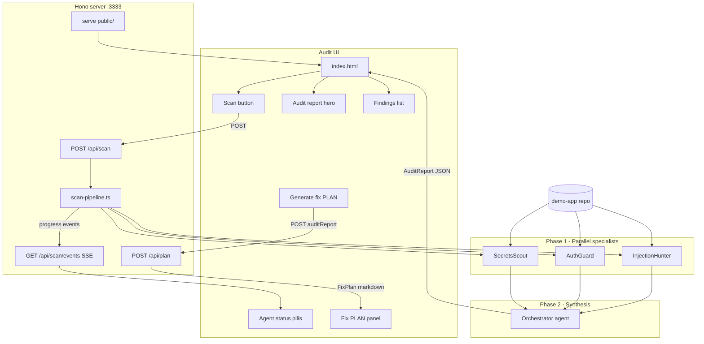

# VibeGuard: Multi-Agent Security Scanner (1-Hour Hackathon)

## Goal

Ship **`npm run dev`** — a local **Audit UI** on one page where you click **Scan**, watch three specialists run in parallel, review an **audit report** synthesized by the **Orchestrator** agent, then **generate a fix PLAN** you can paste into Cursor (or any coding agent) to remediate findings.

```bash
npm run dev          # http://localhost:3333 — primary demo surface
npm run scan         # optional CLI trigger; writes audit report + can skip UI during dev
```

**Stack:** TypeScript + `@cursor/sdk` + **Hono** (tiny HTTP server) + **vanilla HTML/CSS/JS** (no React build step — saves hackathon time). Local agent runtime, model `composer-2.5`.

**Why a web UI for the demo:** judges see audit grade, exploit chain, and findings at a glance; agent pills animate from pending → running → done; **Audit → PLAN** closes the loop from detection to remediation without leaving the browser.

**Naming:**
- **Orchestrator** — the Phase 2 synthesis *agent* (dedupe, grade, narrative). Not to be confused with the TypeScript **scan pipeline** (`scan-pipeline.ts`) that schedules agents and serves HTTP.
- **Audit report** — the structured JSON artifact the Orchestrator produces (formerly “scorecard”).
- **Fix PLAN** — a markdown document derived from the audit report, formatted for coding agents to execute fixes in order.

---

## Architecture



**Data flow:**
1. User opens `localhost:3333` → Audit UI loads (optionally pre-filled from last `public/audit-report.json`).
2. User clicks **Run security scan** → `POST /api/scan` starts the scan pipeline.
3. Scan pipeline emits progress events (`agent:start`, `agent:done`, `orchestrator:start`, `scan:complete`) over **SSE** (`GET /api/scan/events`) so pills update live without polling.
4. On complete, response body (or final SSE event) carries full `AuditReport` → UI renders grade, chain, findings.
5. User clicks **Generate fix PLAN** → `POST /api/plan` (or client-side `buildFixPlan(auditReport)` if behind schedule) returns markdown → preview + **Copy for Cursor**.
6. Server also writes `public/audit-report.json` so refresh preserves last audit.

**SDK pattern:** `Agent.prompt(...)` for all four agents (3 specialists + Orchestrator). CLI `scan.ts` calls the same `runScan()` export as the API route.

**Critical SDK guardrails:**
- Always set `local: { cwd: targetRepo }` explicitly
- Distinguish `CursorAgentError` (HTTP 503) vs `result.status === "error"` (HTTP 502 with partial progress)
- Log `run.id` in server logs for debugging

---

## Repo layout

```
vibeguard/
├── package.json
├── tsconfig.json
├── .env.example              # CURSOR_API_KEY=
├── src/
│   ├── server.ts             # Hono app, static + API + SSE
│   ├── scan.ts               # optional CLI wrapper around runScan()
│   ├── scan-pipeline.ts      # runScan(target, onProgress) → AuditReport
│   ├── plan.ts               # buildFixPlan(auditReport) → FixPlan markdown
│   ├── prompts/
│   │   ├── secrets.ts
│   │   ├── auth.ts
│   │   ├── injection.ts
│   │   └── orchestrator.ts   # Phase 2 synthesis agent
│   └── types.ts
├── public/                   # Audit UI (no bundler)
│   ├── index.html            # one page: audit + PLAN sections
│   ├── styles.css
│   ├── app.js                # fetch scan, SSE, render audit, generate/copy PLAN
│   └── audit-report.json     # last audit (gitignored or committed sample for offline demo)
└── demo-app/                 # intentionally vulnerable target
    └── ...
```

---

## Audit UI design

One scrollable page, **five sections** — keep CSS minimal (system fonts, dark theme reads well on projector). Frame the page as **Security Audit**, not a generic dashboard.

### Section 1: Header + scan control
- Title: **VibeGuard** · subtitle: **Security Audit**
- Target path (`./demo-app`) — read-only for hackathon; no path picker needed
- Primary button: **Run security audit**
- Secondary: link to demo-app README ("what we shipped in one vibe session")

### Section 2: Agent pipeline (live status)
Three horizontal pills for specialists, plus Orchestrator when Phase 1 completes:

| Agent | Idle | Running | Done |
|-------|------|---------|------|
| secrets-scout | gray | pulse amber | green + finding count |
| auth-guard | gray | pulse amber | green + count |
| injection-hunter | gray | pulse amber | green + count |
| orchestrator | hidden until Phase 1 done | pulse | green |

Use SSE events: `{ type: "agent:start", agent: "secrets-scout" }`, `{ type: "agent:done", agent: "...", findings: 2 }`, `{ type: "orchestrator:start" }`, `{ type: "orchestrator:done" }`.

### Section 3: Audit report hero
- Large **grade badge** (`F` / `D` / …) with color (red for F, green for A)
- Severity chips: Critical / High / Medium / Low counts
- **Executive summary** — one paragraph from Orchestrator
- **Top exploit chain** — highlighted callout box (Orchestrator narrative)
- **Demo script** — 3 numbered steps (for presenter to read aloud)

### Section 4: Findings list
- Card per finding: severity badge, title, file:line, evidence monospace block, exploit scenario, fix hint
- Optional checkbox per finding to include/exclude from fix PLAN (default: all critical + high checked)
- Filter tabs: All | Critical | High (optional if time — otherwise sort critical-first only)
- Footer: `agentContributions` simple text ("auth-guard: 3 findings")

### Section 5: Fix PLAN for coding agents
Visible once an audit report exists (disabled until scan completes).

- **Generate fix PLAN** — builds ordered remediation steps from selected findings
- **Preview** — monospace panel with markdown PLAN (scrollable)
- **Copy for Cursor** — clipboard; presenter pastes into Cursor Agent chat on `demo-app`
- Optional: **Download** `fix-plan.md`

**Fix PLAN structure** (deterministic template in `plan.ts`; no extra LLM call required for hackathon). Always emit the **time-box disclaimer** at the top (visually prominent in the UI preview). `buildFixPlan` should cap tasks to what fits **20–30 minutes** (e.g. critical + high only, max 5 tasks, smallest viable fix per task).

```markdown
# Security remediation PLAN

Target repo: ./demo-app
Audit grade: F
Generated: <ISO timestamp>

---

## ⏱️ TIME BOX — READ FIRST (required)

> ### You have **20–30 minutes total** for this entire PLAN.
>
> **Scope must be totally appropriate for that window.** Do not attempt a full security hardening pass, large refactors, new auth systems, or “perfect” fixes.
>
> - Prefer **minimal, targeted patches** (remove a leaked secret, add a guard clause, parameterize one query) over redesigns.
> - If a task would exceed ~10 minutes, **stop after a documented partial fix** or skip it and note why in your summary.
> - **Do not** add new dependencies, frameworks, or test suites unless already in the repo and trivial to run.
> - It is acceptable to fix **only the tasks listed below** and leave lower-severity items for a follow-up PLAN.
>
> **Success = demonstrable risk reduction in the time box**, not an A-grade audit on the first pass.

---

## Instructions for the coding agent
You are fixing security issues identified by an automated audit. Work through tasks **in order** within the **20–30 minute** time box above.
For each task: implement the **smallest correct fix**, run relevant tests or lint if they already exist, and briefly note what changed.
Do not introduce new features. Use fake/test credentials only where secrets are required.
If you cannot finish all tasks in time, complete highest-severity items first and list what was deferred.

## Tasks

### Task 1: [CRITICAL] Remove hardcoded admin token from client
- **File:** `page.tsx` (line ~42)
- **Issue:** Admin token exposed in client bundle
- **Fix:** Move auth to server-side session or env-only server secret
- **Acceptance:** Token string not present in client source; admin route still protected

### Task 2: ...
```

**Stretch:** second button **Enhance PLAN with Orchestrator** — optional `Agent.prompt` that rewrites the template PLAN with richer context (cut if behind).

**Offline demo fallback:** commit a sample `public/audit-report.json` from a successful run so the Audit UI and PLAN generator work even if API key fails during judging.

---

## API contract

```typescript
// POST /api/scan
// Body: { target?: string }  default "./demo-app"
// Response: AuditReport (200) or { error, partial } (502)

// POST /api/plan
// Body: { auditReport: AuditReport; findingIds?: string[] }
// Response: { plan: string }  // markdown Fix PLAN (200)

// GET /api/scan/events  (SSE while scan in flight)
type ScanEvent =
  | { type: "scan:start"; target: string }
  | { type: "agent:start"; agent: string }
  | { type: "agent:done"; agent: string; findings: number }
  | { type: "agent:error"; agent: string; message: string }
  | { type: "orchestrator:start" }
  | { type: "orchestrator:done" }
  | { type: "scan:complete"; auditReport: AuditReport }
  | { type: "scan:error"; message: string };
```

**Concurrency:** only one scan at a time (return 409 if scan already running) — avoids overlapping local agents on same cwd.

---

## Shared agent JSON contract

Specialists return `AgentReport`; Orchestrator agent returns `AuditReport`:

```typescript
interface Finding {
  id: string;
  title: string;
  severity: "critical" | "high" | "medium" | "low";
  category: string;
  file: string;
  line?: number;
  evidence: string;
  exploitScenario: string;
  fixHint: string;
}

interface AuditReport {
  grade: string;
  summary: string;
  findingCount: { critical: number; high: number; medium: number; low: number };
  topExploitChain: string;
  demoScript: string[];
  findings: Finding[];
  agentContributions: Record<string, number>;
}
```

`buildFixPlan(report, selectedFindingIds?)` maps `AuditReport.findings` → markdown: always prepend the time-box disclaimer, sort by severity then file path, and **limit task count** so the PLAN stays realistic for 20–30 minutes (default: critical + high, max 5 tasks).

---

## Agent plans (unchanged missions)

### Agent 1: Secrets Scout
- Credentials, `.env` in repo, client-side leaks, `NEXT_PUBLIC_*` abuse
- Output: `agent: "secrets-scout"`

### Agent 2: Auth Guard
- Missing auth, IDOR, open admin routes, OWASP A01
- Output: `agent: "auth-guard"`

### Agent 3: Injection Hunter
- SQLi, XSS sinks, `eval`, unsafe HTML
- Output: `agent: "injection-hunter"`

### Agent 4: Orchestrator
- Dedupe specialist findings, assign grade, executive summary, exploit chain, demo script
- Input: merged specialist JSON only (no re-scan)
- Output: `AuditReport` JSON

---

## Demo app vuln checklist

| # | Vuln | Where | Severity |
|---|------|-------|----------|
| 1 | Committed `.env` with fake API keys | `.env` | Critical |
| 2 | Hardcoded admin token in client | `page.tsx` | Critical |
| 3 | Missing auth on admin API | `api/admin/route.ts` | High |
| 4 | IDOR via query param | `api/notes/route.ts` | High |
| 5 | SQL/query injection | `api/search/route.ts` | High |
| 6 | Stored XSS | `Note.tsx` | Medium |
| 7 | `eval()` on user input (optional) | util | Critical |

Use fake secrets only (`sk-fake-`, `ghp_fake_`).

---

## 60-minute build schedule (revised for Audit + PLAN)

| Minutes | Task |
|---------|------|
| 0–8 | Scaffold: Hono server, `runScan()` stub, empty Audit UI shell |
| 8–20 | Create `demo-app` with planted vulns |
| 20–32 | Three specialist prompts + test via CLI `scan.ts` |
| 32–42 | Scan pipeline + Orchestrator agent + progress callbacks for SSE |
| 42–50 | **Audit UI:** agent pills, audit report hero, findings list, wire POST + SSE |
| 50–58 | **`plan.ts` + PLAN panel:** generate, preview, copy for Cursor |
| 58–60 | Commit sample `audit-report.json`; rehearse scan → PLAN demo twice |

**Cut if behind:** skip SSE — single blocking POST with spinner; skip finding checkboxes (PLAN includes all critical + high).

**Cut if more behind:** skip filter tabs and agent contribution footer; client-only `buildFixPlan` (no `POST /api/plan`).

**Add if ahead:** Orchestrator-enhanced PLAN, severity filter, expand/collapse finding cards, download `fix-plan.md`.

---

## Demo ideas (browser-first)

### Demo A: "Audit to fix" (recommended)

1. Browser on `localhost:3333` — empty audit, three gray agent pills.
2. Show `demo-app` README: *"Shipped in one Cursor session."*
3. Click **Run security audit** — pills animate; Orchestrator pill appears; grade **F** and exploit chain fill in.
4. Scroll findings — highlight one critical chain.
5. Click **Generate fix PLAN** → preview tasks → **Copy for Cursor** → switch to Cursor on `demo-app` and paste: *"This is the remediation plan from our audit."*
6. Optional: refresh — last audit still visible from `audit-report.json`.

### Demo B: "Before / After"

Pre-load UI with sample `audit-report.json` (grade F). Run audit on `demo-app-safe/` — grade flips to **B**; regenerate PLAN (fewer or no tasks). Strong product story.

### Demo C: "Agent overlap"

Orchestrator's deduped list shows one IDOR flagged by both auth-guard and injection-hunter — "also reported by" tag on finding cards (stretch).

### Demo D: "CI + human loop"

`POST /api/scan` returns `AuditReport` for CI; `POST /api/plan` or exported markdown for developer agents. One slide with GitHub Action pseudo-code — no need to implement in the hour.

---

## CLI role (secondary)

```bash
npm run scan -- ./demo-app   # runs runScan(), writes public/audit-report.json, prints grade one-liner
```

Terminal output is minimal (grade + path to open Audit UI). **Judges see the browser: audit → PLAN → Cursor.**

---

## Success criteria

- `npm run dev` serves Audit UI on port 3333
- Scan button triggers full multi-agent pipeline and renders **audit report** in browser
- Agent status visible during scan (SSE or blocking with clear loading state)
- **Generate fix PLAN** produces copy-pasteable markdown for a coding agent from the audit report
- At least **5 of 7** planted vulns detected
- Sample `audit-report.json` committed for offline fallback
- Demo rehearsed in **under 3 minutes**: scan → audit → copy PLAN

---

## Optional stretch (post-hackathon)

- Orchestrator agent also drafts PLAN prose (in addition to template `plan.ts`)
- Fourth specialist: Dependency Sentry
- WebSocket instead of SSE
- Vite + React if you outgrow vanilla JS
- Cloud runtime + one-click "Open in Cursor" deep link with PLAN in context
