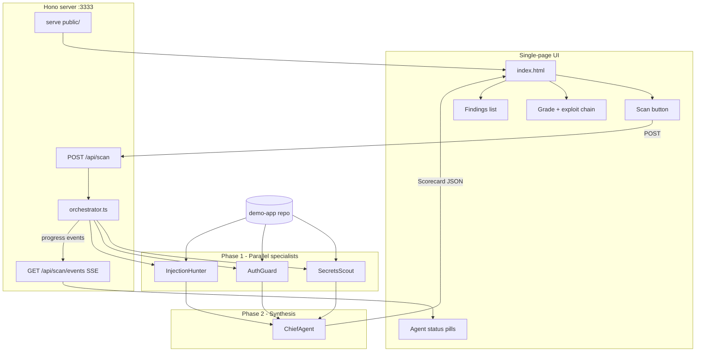

# VibeGuard: Multi-Agent Security Scanner (1-Hour Hackathon)

## Goal

Ship **`npm run dev`** — a local web app on one page where you click **Scan**, watch three agents run in parallel, and see a **judge-friendly security scorecard** in the browser (not just the terminal).

```bash
npm run dev          # http://localhost:3333 — primary demo surface
npm run scan         # optional CLI trigger; writes report + can skip UI during dev
```

**Stack:** TypeScript + `@cursor/sdk` + **Hono** (tiny HTTP server) + **vanilla HTML/CSS/JS** (no React build step — saves hackathon time). Local agent runtime, model `composer-2.5`.

**Why a web UI for the demo:** judges see grade, exploit chain, and findings at a glance; agent pills animate from pending → running → done; much stronger than scrolling terminal output.

---

## Architecture



**Data flow:**
1. User opens `localhost:3333` → static single page loads (optionally pre-filled from last `report.json`).
2. User clicks **Scan demo-app** → `POST /api/scan` starts orchestrator.
3. Orchestrator emits progress events (`agent:start`, `agent:done`, `chief:start`, `scan:complete`) over **SSE** (`GET /api/scan/events`) so pills update live without polling.
4. On complete, response body (or final SSE event) carries full `Scorecard` → UI renders grade, chain, findings.
5. Server also writes `public/report.json` so refresh preserves last result.

**SDK pattern:** `Agent.prompt(...)` for all four agents. CLI `scan.ts` calls the same `runScan()` export as the API route.

**Critical SDK guardrails:**
- Always set `local: { cwd: targetRepo }` explicitly
- Distinguish `CursorAgentError` (HTTP 503) vs `result.status === "error"` (HTTP 502 with partial progress)
- Log `run.id` in server logs for debugging

---

## Repo layout

```
vibeguard/
├── package.json
├── tsconfig.json
├── .env.example              # CURSOR_API_KEY=
├── src/
│   ├── server.ts             # Hono app, static + API + SSE
│   ├── scan.ts               # optional CLI wrapper around runScan()
│   ├── orchestrator.ts       # runScan(target, onProgress) → Scorecard
│   ├── prompts/
│   │   ├── secrets.ts
│   │   ├── auth.ts
│   │   ├── injection.ts
│   │   └── chief.ts
│   └── types.ts
├── public/                   # single-page UI (no bundler)
│   ├── index.html            # one page: layout + sections
│   ├── styles.css
│   ├── app.js                # fetch scan, SSE, render scorecard
│   └── report.json           # last scan (gitignored or committed sample for offline demo)
└── demo-app/                 # intentionally vulnerable target
    └── ...
```

---

## Single-page UI design

One scrollable page, four sections — keep CSS minimal (system fonts, dark theme reads well on projector).

### Section 1: Header + scan control
- Title: **VibeGuard**
- Subtitle: target path (`./demo-app`) — read-only for hackathon; no path picker needed
- Primary button: **Run security scan**
- Secondary: link to demo-app README ("what we shipped in one vibe session")

### Section 2: Agent pipeline (live status)
Three horizontal pills, each showing agent name + state:

| Agent | Idle | Running | Done |
|-------|------|---------|------|
| secrets-scout | gray | pulse amber | green + finding count |
| auth-guard | gray | pulse amber | green + count |
| injection-hunter | gray | pulse amber | green + count |
| chief (synthesizer) | hidden until Phase 1 done | pulse | green |

Use SSE events: `{ type: "agent:start", agent: "secrets-scout" }`, `{ type: "agent:done", agent: "...", findings: 2 }`.

### Section 3: Scorecard hero
- Large **grade badge** (`F` / `D` / …) with color (red for F, green for A)
- Severity chips: Critical / High / Medium / Low counts
- **Top exploit chain** — highlighted callout box (Chief narrative)
- **Demo script** — 3 numbered steps (for presenter to read aloud)

### Section 4: Findings list
- Card per finding: severity badge, title, file:line, evidence monospace block, exploit scenario, fix hint
- Filter tabs: All | Critical | High (optional if time — otherwise sort critical-first only)
- Footer: `agentContributions` bar chart or simple text ("auth-guard: 3 findings")

**Offline demo fallback:** commit a sample `public/report.json` from a successful run so the UI looks populated even if API key fails during judging.

---

## API contract

```typescript
// POST /api/scan
// Body: { target?: string }  default "./demo-app"
// Response: Scorecard (200) or { error, partial } (502)

// GET /api/scan/events  (SSE while scan in flight)
type ScanEvent =
  | { type: "scan:start"; target: string }
  | { type: "agent:start"; agent: string }
  | { type: "agent:done"; agent: string; findings: number }
  | { type: "agent:error"; agent: string; message: string }
  | { type: "chief:start" }
  | { type: "chief:done" }
  | { type: "scan:complete"; scorecard: Scorecard }
  | { type: "scan:error"; message: string };
```

**Concurrency:** only one scan at a time (return 409 if scan already running) — avoids overlapping local agents on same cwd.

---

## Shared agent JSON contract

Unchanged from prior plan — specialists return `AgentReport`, Chief returns `Scorecard`:

```typescript
interface Finding {
  id: string;
  title: string;
  severity: "critical" | "high" | "medium" | "low";
  category: string;
  file: string;
  line?: number;
  evidence: string;
  exploitScenario: string;
  fixHint: string;
}

interface Scorecard {
  grade: string;
  summary: string;
  findingCount: { critical: number; high: number; medium: number; low: number };
  topExploitChain: string;
  demoScript: string[];
  findings: Finding[];
  agentContributions: Record<string, number>;
}
```

---

## Agent plans (unchanged missions)

### Agent 1: Secrets Scout
- Credentials, `.env` in repo, client-side leaks, `NEXT_PUBLIC_*` abuse
- Output: `agent: "secrets-scout"`

### Agent 2: Auth Guard
- Missing auth, IDOR, open admin routes, OWASP A01
- Output: `agent: "auth-guard"`

### Agent 3: Injection Hunter
- SQLi, XSS sinks, `eval`, unsafe HTML
- Output: `agent: "injection-hunter"`

### Agent 4: Chief Agent
- Dedupe, grade, exploit chain, demo script
- Input: merged specialist JSON only (no re-scan)

---

## Demo app vuln checklist

| # | Vuln | Where | Severity |
|---|------|-------|----------|
| 1 | Committed `.env` with fake API keys | `.env` | Critical |
| 2 | Hardcoded admin token in client | `page.tsx` | Critical |
| 3 | Missing auth on admin API | `api/admin/route.ts` | High |
| 4 | IDOR via query param | `api/notes/route.ts` | High |
| 5 | SQL/query injection | `api/search/route.ts` | High |
| 6 | Stored XSS | `Note.tsx` | Medium |
| 7 | `eval()` on user input (optional) | util | Critical |

Use fake secrets only (`sk-fake-`, `ghp_fake_`).

---

## 60-minute build schedule (revised for UI)

| Minutes | Task |
|---------|------|
| 0–8 | Scaffold: Hono server, `runScan()` stub, empty `public/index.html` shell |
| 8–20 | Create `demo-app` with planted vulns |
| 20–32 | Three specialist prompts + test via CLI `scan.ts` |
| 32–42 | Orchestrator + Chief + progress callbacks for SSE |
| 42–52 | **Web UI:** agent pills, scorecard hero, findings list, wire POST + SSE |
| 52–60 | Commit sample `report.json`; rehearse browser demo twice |

**Cut if behind:** skip SSE — use single blocking POST with spinner text "Scanning… (~90s)"; pills jump to done all at once when response returns.

**Cut if more behind:** skip filter tabs and agent contribution chart.

**Add if ahead:** severity filter, expand/collapse finding cards, `--fix-top` button on UI.

---

## Demo ideas (browser-first)

### Demo A: "Vibe Check Live" (recommended)

1. Browser on `localhost:3333` — empty scorecard, three gray agent pills.
2. Show `demo-app` README in another tab: *"Shipped in one Cursor session."*
3. Click **Run security scan** — pills turn amber one by one, then green with counts.
4. Page animates to grade **F**, red badge, exploit chain callout fills in.
5. Scroll findings — click one critical: *"Hardcoded token in client + open admin API."*
6. Optional: refresh page — last report still visible from `report.json`.

### Demo B: "Before / After"

Pre-load UI with sample `report.json` (grade F). Run scan on `demo-app-safe/` (pre-built clean variant) — grade flips to **B** in same UI. Strong product story without new code.

### Demo C: "Agent Debate"

Chief's deduped list shows one IDOR flagged by both auth-guard and injection-hunter — mention in UI subtitle or a "also reported by" tag on finding cards (stretch).

### Demo D: "CI Gate"

Show that `POST /api/scan` returns JSON consumable by CI; UI is the human-facing layer. One slide with GitHub Action pseudo-code — no need to implement in the hour.

---

## CLI role (secondary)

Keep `npm run scan` for fast iteration without opening browser:

```bash
npm run scan -- ./demo-app   # runs runScan(), writes public/report.json, prints grade one-liner
```

Terminal output is minimal (grade + path to open UI). **Judges see the web page, not the terminal.**

---

## Success criteria

- `npm run dev` serves single-page UI on port 3333
- Scan button triggers full multi-agent pipeline and renders scorecard in browser
- Agent status visible during scan (SSE or blocking with clear loading state)
- At least **5 of 7** planted vulns detected
- Sample `report.json` committed for offline fallback
- Demo rehearsed in **under 3 minutes** with browser as primary surface

---

## Optional stretch (post-hackathon)

- Fourth agent: Dependency Sentry
- WebSocket instead of SSE
- Vite + React if you outgrow vanilla JS
- Cloud runtime + auto-fix PR from UI button
